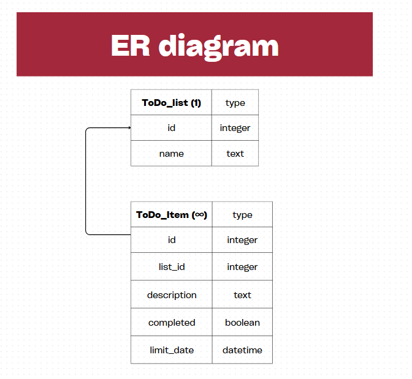

## Diagrama de la Base de Datos



## Características de mi MCP

- **Gestión de listas**: Crear, actualizar, eliminar y listar listas de tareas
- **Gestión de elementos**: Agregar, modificar, completar y eliminar tareas
- **Base de datos**: SQLite con SQLAlchemy en python
- **Dockerizado**: Para un despiegue más fácil

## Modos de ejecución

### Con Docker
```powershell
docker-compose up --build
```
Esto hace que el servidor mcp funcione, y que además se cree la db.

### Instalación manual local
```powershell
#dependencias
pip install -r requirements.txt

#crear la db
cd db
python createdb.py

#ejecutar el servidor mcp
python todo_mcp.py
```

## Para probar la app

Cuando ya tengas todo funcionando, podes probar los endpoints con fastapi.
### Probar API REST (FastAPI)
```powershell
#primero entras al contenedor
docker-compose exec todo-mcp bash

#ejecutas main que es donde esta el crud
python main.py
```

La API se despliega en: `http://localhost:8001`
- Fastapi ofrece documentacion interactuva para ahorrarte el uso de otras apps como Postman, en: `http://localhost:8001/docs`
- **algunos de lso endpoints son**:
  - `GET /lists/` - Ver todas las listas
  - `POST /lists/` - Crear nueva lista
  - `PUT /lists/{id}` - Actualizar lista
  - `DELETE /lists/{id}` - Eliminar lista
  - `GET /lists/{id}/items/` - Ver items de una lista
  - `POST /lists/{id}/items/` - Crear item en lista

## Estructura del proyecto
- `db/todo_mcp.py` - todo lo del mcp
- `db/createdb.py` - configuracion para crear db y sqlalchemy
- `db/main.py` - crud de la api rest con fastapi
- `requirements.txt` - dependencias 
- `Dockerfile` - docker
- `docker-compose.yml` - docker

## Dependencias

- `mcp` - Model Context Protocol
- `fastapi` - api
- `sqlalchemy` - ORM de db
- `uvicorn` - Servidor ASGI

